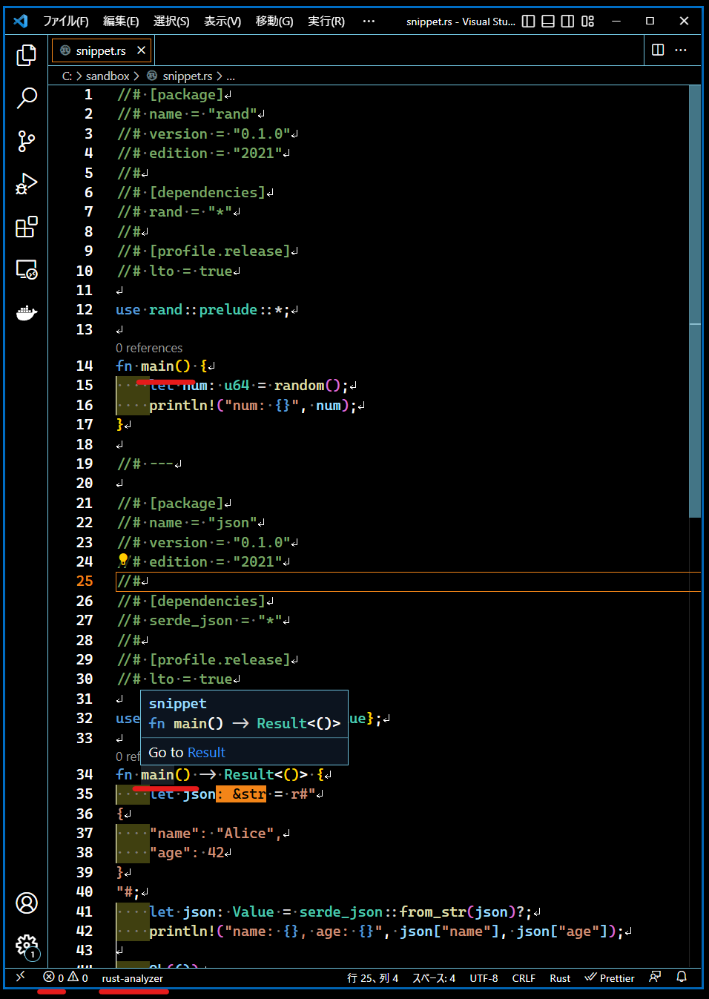

# PIT

Run Rust snippet containing multiple packages. Embed `Cargo.toml` as a comment to avoid special formatting.

- Run snippet in debug mode
- Build packages in snippet in release mode and distribute the artifacts to the directory
- Extract packages in snippet as independent packages

There is a simple cache system, [as described below](https://github.com/NaokiM03/rspit#note).


## Motivation

- rust-analyzer supports single file

  - https://github.com/rust-lang/rust-analyzer/issues/6388
    - https://github.com/rust-lang/rust-analyzer/pull/8955
  - In such a case, it is not an error even if multiple main functions exist

  <details>
  <summary>Snippet on VSCode</summary>

  

  </details>

## Usage

```sh
$ cargo install rspit
# omitted

$ cat ./snippet.rs
//# [package]
//# name = "rand"
//# version = "0.1.0"
//# edition = "2021"
//#
//# [dependencies]
//# rand = "*"

use rand::prelude::*;

fn main() {
    let num: u64 = random();
    println!("num: {}", num);
}

//# ---

//# [package]
//# name = "json"
//# version = "0.1.0"
//# edition = "2021"
//#
//# [dependencies]
//# serde_json = "*"

use serde_json::{Result, Value};

fn main() -> Result<()> {
    let json = r#"
{
    "name": "Alice",
    "age": 42
}
"#;
    let json: Value = serde_json::from_str(json)?;
    println!("name: {}, age: {}", json["name"], json["age"]);

    Ok(())
}

$ pit run ./snippet.rs
# omitted cargo log messages
Run rand package
num: 17349477736480811228
# omitted cargo log messages
Run json package
name: "Alice", age: 42
```

```sh
$ pit --help
A command-line tool to run Rust snippet.

Usage: pit.exe [COMMAND]

Commands:
  run      Run all package in file
  build    Build all package in file
  release  Build all package in file in release mode and copy the artifacts to the target directory
  init     Create a new file
  list     List all packages in the given file
  add      Add an empty package on top in the given file
  extract  Extract the package from file
  clean    Remove everything in the cache directory
  help     Print this message or the help of the given subcommand(s)

Options:
  -h, --help     Print help information
  -V, --version  Print version information
```

## Note

- The `target` directory is cached
- Always build **in debug mode** when `run` and `build` are executed
- If the source files have not been modified at the time of `run` execution and debug mode artifacts are present, the binary is executed directly without building


## Related projects

- [rust-script](https://github.com/fornwall/rust-script)
  and the projects listed in the README.

## License

PIT is released under the MIT License
